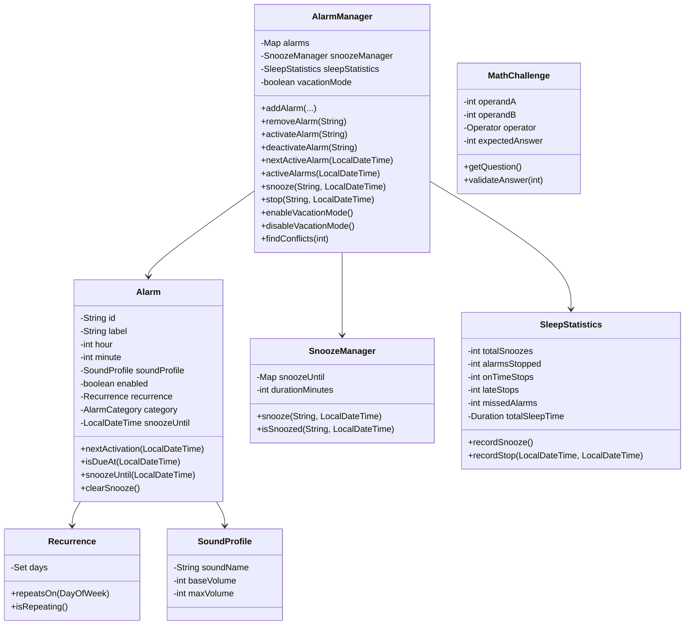

# Diseño orientado a objetos

## Clases principales

- `Alarm`: representa una alarma individual con hora, etiqueta, categoría, sonido, estado y repetición.
- `Recurrence`: encapsula la repetición semanal como un conjunto de días de la semana.
- `SoundProfile`: modela el nombre del sonido y el volumen base/máximo.
- `AlarmManager`: administra el ciclo de vida de múltiples alarmas, modo vacaciones, conflictos y próxima alarma activa.
- `SnoozeManager`: aplica la lógica de posponer alarmas y controla los tiempos de snooze.
- `MathChallenge`: representa el reto matemático para apagar una alarma.
- `SleepStatistics`: recoge métricas de sueño, retrasos y número de posposiciones.

## Relaciones y responsabilidades

- `AlarmManager` coordina operaciones de alto nivel y conserva la colección de alarmas.
- `Alarm` mantiene su propia configuración y decide cuándo es dueña de un evento.
- `Recurrence` desacopla la lógica de días de la semana de la clase `Alarm`.
- `SnoozeManager` y `MathChallenge` son servicios/entidades especializadas que no almacenan alarmas completas.

## Diagrama de clases (Mermaid)

## Justificación del diseño

- `Alarm` es el núcleo del dominio y expone solo el estado necesario para su gestión.
- `AlarmManager` conserva la colección y aplica reglas de negocio como el modo vacaciones y la detección de conflictos.
- `Recurrence` simplifica la extensión de patrones de repetición y facilita la reutilización.
- `SnoozeManager` separa la lógica de posponer alarmas del estado principal de `Alarm`.
- `MathChallenge` es una entidad independiente porque su comportamiento puede cambiar sin afectar al resto del sistema.

## Encapsulación y visibilidad

- Atributos de estado son privados.
- Los métodos públicos en `Alarm` exponen solo operaciones seguras (`enable`, `disable`, `setTime`, `setLabel`).
- `AlarmManager` ofrece una API de mayor nivel, manteniendo los detalles de implementación ocultos.

## Diagrama e imágenes asociadas

Los diagramas UML y las capturas de ejecución se documentan en `docs/Diagrams.md`.
- `docs/diagrams/class-diagram.png`
- `docs/diagrams/usecase-diagram.png`
- `docs/screenshots/main-output.png`
- `docs/screenshots/demo-output.png`
